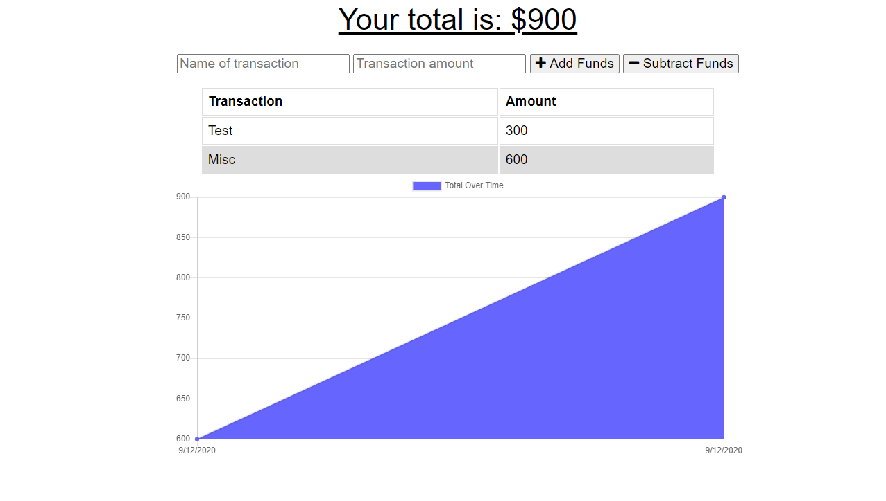

  # PWA Budget Tracker

  ## Description
  

  Progressive Web App for tracking your budget. Tracker works offline and can be added to device home screen

  ## Table of Contents  
  [Installation](#Installation)  
  [License](#License)  
  [Contributing](#Contributing)  
  [Tests](#Tests)  
  [Deployed](#Deployed)
  [Demo](#Demo) 
  [Questions](#Questions) 
   

  ## Installation
  npm i to install dependencies and run using node 

  ## License
  MIT

  ## Contributing
  N/A

  ## Tests
  No

  ## Deployed
  https://secure-coast-48273.herokuapp.com/

  ## Demo
  

  ## Questions
  Github: ldipaola
  Email: ldipaola66@gmail.com
